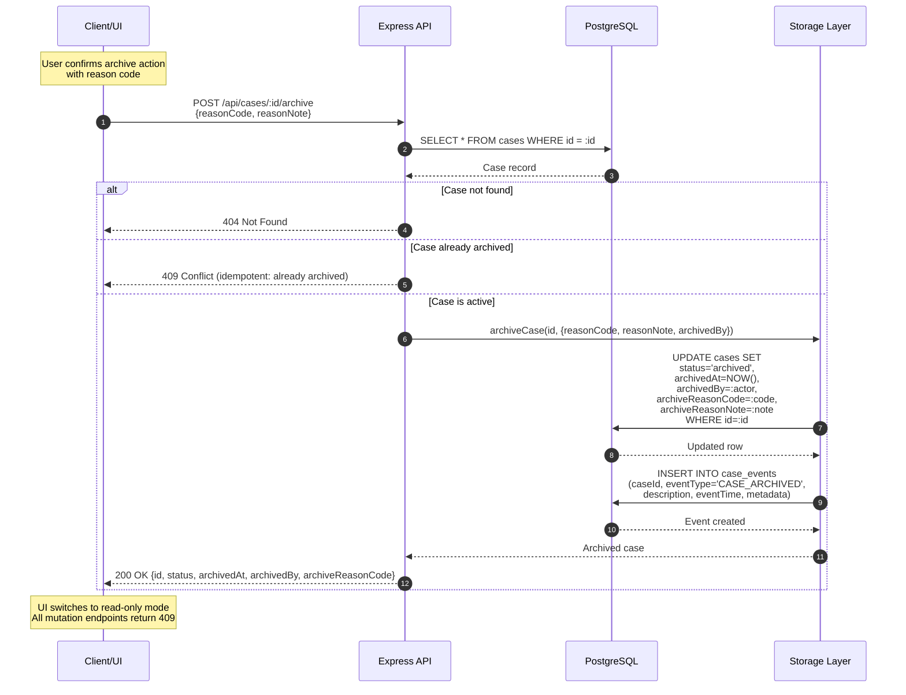
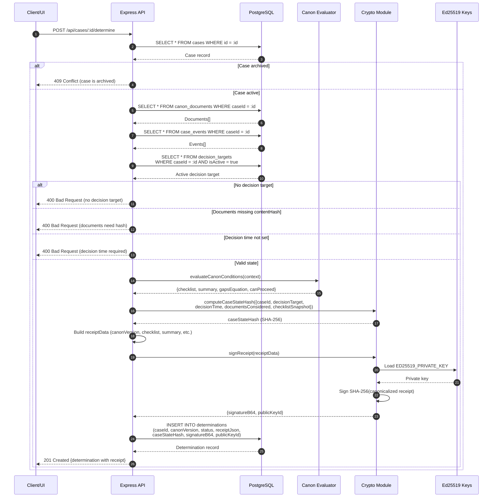
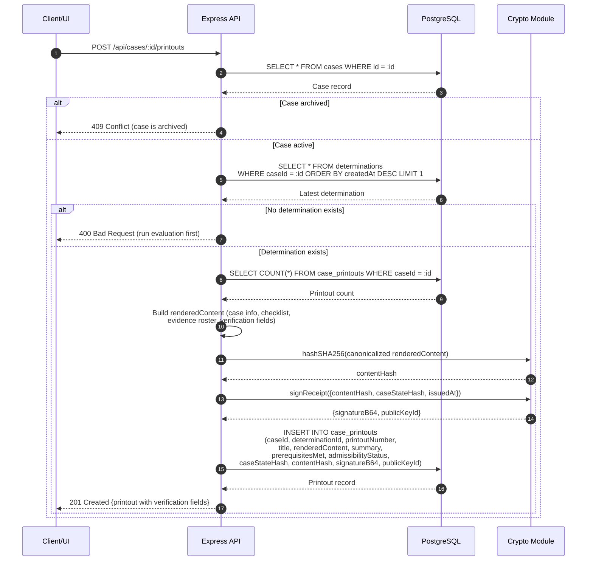
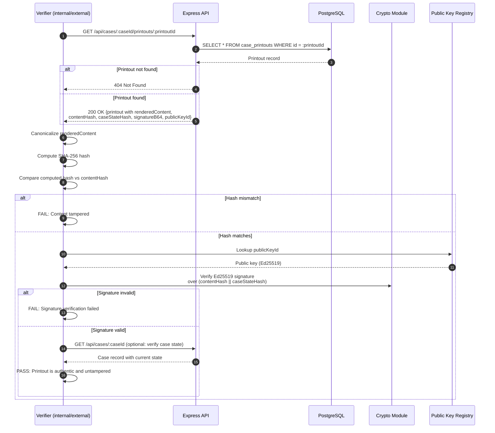

# ELI Imaging — Architecture Specification

This document formalizes existing system behavior for case archival, determination signing, and verification. It does not propose redesign or storage migration.

**Storage:** PostgreSQL (source of truth)  
**External Reference:** WORM object store (referenced by hashes/URIs, immutable)

---

## 1. Case Archival Sequence



### Idempotent Archive Handling

| Scenario | Response |
|----------|----------|
| Case not found | 404 Not Found |
| Case already archived (same state) | 409 Conflict with existing archive metadata |
| Case is active | 200 OK, archive executed |
| Archived case mutation attempt | 409 Conflict |

---

## 2. Determination Signing Sequence



---

## 3. Printout Issuance Sequence



---

## 4. Verification Sequence



---

## 5. JSON Schemas

### 5.1 Determination Receipt Schema

```json
{
  "$schema": "https://json-schema.org/draft/2020-12/schema",
  "$id": "eli-imaging/determination-receipt",
  "title": "DeterminationReceipt",
  "type": "object",
  "required": [
    "receiptVersion",
    "canonVersion",
    "caseId",
    "decisionTarget",
    "decisionTime",
    "policyThresholds",
    "documentsConsidered",
    "checklist",
    "summary",
    "caseStateHash"
  ],
  "properties": {
    "receiptVersion": {
      "type": "string",
      "const": "1.0"
    },
    "canonVersion": {
      "type": "string",
      "enum": ["4.0"]
    },
    "caseId": {
      "type": "string"
    },
    "decisionTarget": {
      "type": "object",
      "required": ["text"],
      "properties": {
        "text": { "type": "string" },
        "setAt": { "type": ["string", "null"], "format": "date-time" },
        "setBy": { "type": ["string", "null"] }
      }
    },
    "decisionTime": {
      "type": "object",
      "required": ["timestamp"],
      "properties": {
        "mode": { "type": "string", "enum": ["explicit", "inferred"] },
        "timestamp": { "type": "string", "format": "date-time" },
        "source": { "type": "string" }
      }
    },
    "policyThresholds": {
      "type": "object",
      "required": ["minConditionsMet", "totalConditions", "temporalRequired"],
      "properties": {
        "minConditionsMet": { "type": "integer", "minimum": 0, "maximum": 5 },
        "totalConditions": { "type": "integer", "const": 5 },
        "temporalRequired": { "type": "boolean" }
      }
    },
    "documentsConsidered": {
      "type": "array",
      "items": {
        "type": "object",
        "required": ["docId", "sha256"],
        "properties": {
          "docId": { "type": "string" },
          "filename": { "type": "string" },
          "sha256": { "type": "string", "pattern": "^[a-f0-9]{64}$" },
          "uploadedAt": { "type": "string", "format": "date-time" },
          "version": { "type": "string" }
        }
      }
    },
    "checklist": {
      "type": "object",
      "required": [
        "A_decision_target_defined",
        "B_temporal_verification",
        "C_independent_verification",
        "D_policy_application_record",
        "E_contextual_constraints"
      ],
      "properties": {
        "A_decision_target_defined": { "$ref": "#/$defs/conditionStatus" },
        "B_temporal_verification": { "$ref": "#/$defs/conditionStatus" },
        "C_independent_verification": { "$ref": "#/$defs/conditionStatus" },
        "D_policy_application_record": { "$ref": "#/$defs/conditionStatus" },
        "E_contextual_constraints": { "$ref": "#/$defs/conditionStatus" }
      }
    },
    "summary": {
      "type": "object",
      "required": ["conditionsMet", "conditionsTotal", "status"],
      "properties": {
        "conditionsMet": { "type": "integer", "minimum": 0, "maximum": 5 },
        "conditionsTotal": { "type": "integer", "const": 5 },
        "status": { "type": "string", "enum": ["Decision Permitted", "Advisory Only", "Blocked"] },
        "explanationPlain": { "type": "string" }
      }
    },
    "gapsEquation": {
      "type": "array",
      "items": { "type": "string" }
    },
    "caseStateHash": {
      "type": "object",
      "required": ["sha256"],
      "properties": {
        "sha256": { "type": "string", "pattern": "^[a-f0-9]{64}$" }
      }
    },
    "signature": {
      "type": "object",
      "properties": {
        "algorithm": { "type": "string", "const": "Ed25519" },
        "publicKeyId": { "type": "string" },
        "signatureB64": { "type": "string" }
      }
    }
  },
  "$defs": {
    "conditionStatus": {
      "type": "object",
      "required": ["required", "met"],
      "properties": {
        "required": { "type": "boolean" },
        "met": { "type": "boolean" },
        "evidenceRefs": { "type": "array", "items": { "type": "string" } }
      }
    }
  }
}
```

### 5.2 Case Printout Schema

```json
{
  "$schema": "https://json-schema.org/draft/2020-12/schema",
  "$id": "eli-imaging/case-printout",
  "title": "CasePrintout",
  "type": "object",
  "required": [
    "id",
    "caseId",
    "determinationId",
    "printoutNumber",
    "title",
    "renderedContent",
    "summary",
    "prerequisitesMet",
    "prerequisitesTotal",
    "admissibilityStatus",
    "caseStateHash",
    "contentHash",
    "signatureB64",
    "publicKeyId",
    "issuedAt"
  ],
  "properties": {
    "id": { "type": "string" },
    "caseId": { "type": "string" },
    "determinationId": { "type": "string" },
    "printoutNumber": { "type": "integer", "minimum": 1 },
    "title": { "type": "string" },
    "renderedContent": {
      "type": "object",
      "description": "Structured printout content including case info, checklist, evidence roster"
    },
    "summary": { "type": "string" },
    "prerequisitesMet": { "type": "integer", "minimum": 0, "maximum": 5 },
    "prerequisitesTotal": { "type": "integer", "const": 5 },
    "admissibilityStatus": {
      "type": "string",
      "enum": ["Decision Permitted", "Advisory Only", "Blocked"]
    },
    "caseStateHash": {
      "type": "string",
      "pattern": "^[a-f0-9]{64}$",
      "description": "SHA-256 hash of case state at time of printout issuance"
    },
    "contentHash": {
      "type": "string",
      "pattern": "^[a-f0-9]{64}$",
      "description": "SHA-256 hash of canonicalized renderedContent"
    },
    "signatureB64": {
      "type": "string",
      "description": "Ed25519 signature over (contentHash || caseStateHash)"
    },
    "publicKeyId": {
      "type": "string",
      "description": "Identifier of the signing key for verification"
    },
    "issuedAt": {
      "type": "string",
      "format": "date-time"
    }
  }
}
```

### 5.3 Archive Event Schema

```json
{
  "$schema": "https://json-schema.org/draft/2020-12/schema",
  "$id": "eli-imaging/archive-event",
  "title": "CaseArchiveEvent",
  "type": "object",
  "required": [
    "id",
    "caseId",
    "eventType",
    "description",
    "eventTime",
    "metadata"
  ],
  "properties": {
    "id": { "type": "string" },
    "caseId": { "type": "string" },
    "eventType": { "type": "string", "const": "CASE_ARCHIVED" },
    "description": { "type": "string" },
    "eventTime": { "type": "string", "format": "date-time" },
    "metadata": {
      "type": "object",
      "required": ["reasonCode"],
      "properties": {
        "reasonCode": {
          "type": "string",
          "enum": ["DUPLICATE", "ENTERED_IN_ERROR", "COMPLETED", "CANCELLED", "OTHER"]
        },
        "reasonNote": { "type": ["string", "null"] },
        "archivedBy": { "type": "string" },
        "priorStatus": { "type": "string", "const": "active" }
      }
    }
  }
}
```

---

## 6. Signing Field Specification

### What is signed (Determination)

```
signedPayload = SHA-256(canonicalize({
  caseId,
  decisionTarget.text,
  decisionTime.timestamp,
  documentsConsidered[].{docId, sha256},
  checklist.{A..E}.met,
  summary.{conditionsMet, status}
}))

caseStateHash = SHA-256(signedPayload)

signature = Ed25519.sign(privateKey, caseStateHash)
```

### What is signed (Printout)

```
contentHash = SHA-256(canonicalize(renderedContent))

signatureInput = contentHash || caseStateHash

signature = Ed25519.sign(privateKey, signatureInput)
```

### Canonicalization

- JSON fields sorted alphabetically
- No whitespace
- UTF-8 encoding
- Null values excluded from hash input

---

## 7. WORM Reference Pattern

When external WORM storage is used:

| Field | Location | Description |
|-------|----------|-------------|
| `objectUri` | WORM store | Immutable blob address |
| `contentHash` | PostgreSQL | SHA-256 of content for verification |
| `caseStateHash` | PostgreSQL | SHA-256 of case state at creation |

PostgreSQL holds metadata and references. WORM holds immutable artifacts. Verification fetches from WORM and recomputes hash against stored `contentHash`.

---

*Document created: 2026-01-17*  
*This specification formalizes existing ELI Imaging behavior. It does not propose migration or redesign.*
